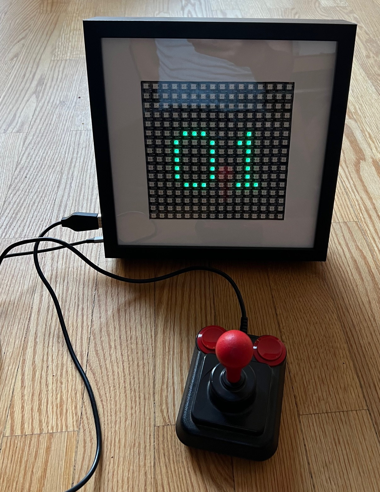
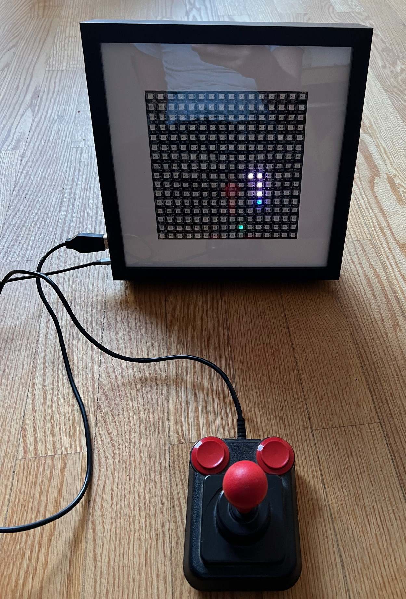
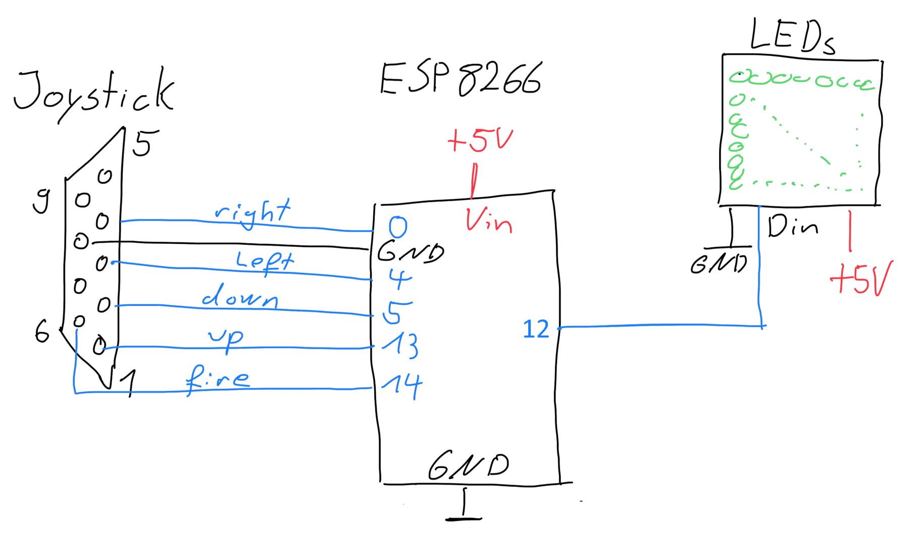

# Snake on a 16x16 LED matrix

A while back, I came across a 16x16 LED matrix equipped with WS2812 LEDs and couldn't resist purchasing it. At first, I didn't have a specific purpose in mind for it, so I decided to experiment. I connected it to an ESP8266 microcontroller and integrated an old joystick from the Commodore C64 era. To give it a neat finish, I housed the entire setup in an IKEA Sannahed picture frame and then developed some software to bring it all to life.

## Shopping list
 - 16x16 LED matrix w/ WS2812B Leds like [this](https://de.aliexpress.com/item/1005005034320069.html)
  - any ESP8266 board 
  - some 5V power (I use a USB-C to 5V step down chip)
  - IKEA Sannahed 25 x 25cm
  - Sub D 9 pin connector for the joystick

## Wiring

The three cables from the LED matrix are connected as follows: one goes to GND, another to +5V, and the last one to GPIO12. That's all that's needed for the display setup.

These old joysticks are essentially composed of switches connected to a common signal. Each button simply shorts this common signal to one of the pins on the sub-D connector. To set it up, simply connect the common signal to GND and the other pins to some GPIOs configured as inputs with pull-up resistors enabled."

On some different boards the GPIOs my have other names:
 - GPIO_12 output for LED = D6
 - GPIO_00 input joystick right = D3
 - GPIO_04 input joystick left = D2
 - GPIO_05 input joystick down = D1
 - GPIO_13 input joystick up = D7
 - GPIO_14 input joystick fire = D5

## Software

I  quickly hacked together some code to do something useful with these LEDs. It was never intended to be published, but it works.

Simply open it in the Arduino IDE, compile it, and then flash it to the ESP.

It depends only on the FastLED libaray. Tested with version 3.6.
